# MVP — Pipeline de Dados da B3 no Databricks

**Autor:** Alexandre Pitz Espindola  
**Curso:** Pós-Graduação em Ciência de Dados & Analytics — PUC-Rio  
**Plataforma:** Databricks Free Edition  
**Repositório:** [github.com/alexpitz/mvp-b3-databricks](https://github.com/alexpitz/mvp-b3-databricks)  
**Fonte principal:** B3 — Brasil, Bolsa, Balcão

> Projeto desenvolvido exclusivamente para fins acadêmicos e educacionais. Os resultados e o ranking apresentados não constituem recomendação de investimento. Rentabilidade passada não garante resultados futuros.

## Contexto de Negócios e Perguntas (Etapa 2 e 4.1)

### Contexto e objetivo

O mercado acionário brasileiro possui centenas de ativos com diferentes níveis de liquidez, risco e retorno. Analisar os arquivos públicos da B3 diretamente é trabalhoso porque o COTAHIST utiliza um formato textual posicional e não contém a classificação setorial pronta para análise.

O objetivo deste MVP é construir um pipeline de dados na nuvem que transforme as cotações históricas da B3 em tabelas organizadas e indicadores capazes de apoiar o entendimento do comportamento do mercado.

### Perguntas de negócio

1. Qual foi o comportamento dos principais setores entre as ações mais negociadas na B3?
2. Considerando uma série histórica fechada de um ano, quais sinais quantitativos descrevem um cenário mais ou menos favorável para os meses seguintes?
3. Quais ações da B3 merecem uma análise mais aprofundada segundo critérios transparentes de liquidez, retorno, tendência e risco?

### Escopo dos dados brutos

O período analisado é o ano civil de **2025**. A principal fonte é o arquivo anual `COTAHIST_A2025.TXT`, no qual cada linha representa a negociação diária de um ativo. Entre os campos utilizados estão:

- data do pregão e código de negociação;
- tipo de mercado, nome resumido, especificação e ISIN;
- preços de abertura, máximo, mínimo, médio e fechamento;
- número de negócios, quantidade negociada e volume financeiro.

Os preços do arquivo possuem duas casas decimais implícitas. O enriquecimento setorial utiliza uma referência derivada da classificação pública da B3, com `ticker`, `empresa`, `setor`, `subsetor` e `segmento`. Foram utilizados **359 códigos-base atuais** e **46 tickers históricos complementares**, totalizando **405 registros de referência**.

### Fonte e licença dos dados

Os dados foram obtidos no [Hub de Dados Públicos da B3](https://www.b3.com.br/pt_br/dados/hub-de-dados-publicos/). A disponibilização pública não representa uma licença irrestrita: permanecem aplicáveis os termos, as políticas e as condições de uso publicados pela B3. Este projeto:

- identifica a fonte dos dados;
- utiliza os arquivos apenas para finalidade acadêmica;
- não redistribui o COTAHIST nem os demais dados brutos;
- disponibiliza somente código, documentação e evidências derivadas.

## Carga dos Dados (Etapa 4.2)

Os arquivos foram enviados para um Volume do Unity Catalog:

```text
/Volumes/workspace/mvp_b3/landing/
├── cotahist/
│   └── COTAHIST_A2025.TXT
├── referencia/
│   └── setores_b3.csv
└── quarentena/
```

O notebook [`00_setup.ipynb`](notebooks/00_setup.ipynb) cria ou valida catálogo, schema, Volume e diretórios. O notebook [`01_bronze_ingest.ipynb`](notebooks/01_bronze_ingest.ipynb) lê os arquivos, preserva a linha original do COTAHIST e acrescenta caminho de origem, horário de ingestão e hash SHA-256.

A carga Bronze produziu **3.174.698 registros de cotação** e **405 registros de referência setorial**.

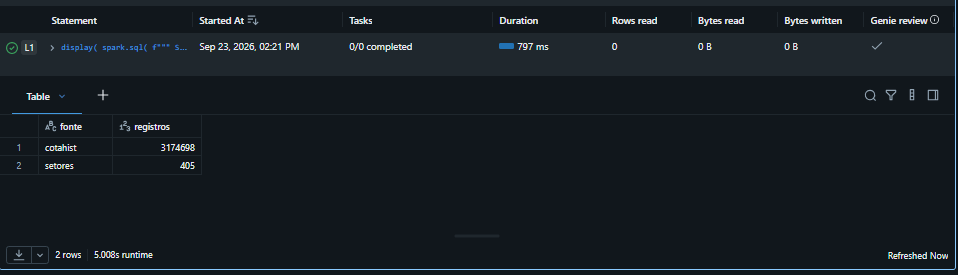

*Figura 1 — Contagens da camada Bronze após a ingestão do COTAHIST 2025 e da referência setorial.*

## Modelagem e Catálogo de Dados (Etapa 4.3)

Foi adotada a arquitetura Medalhão, com tabelas Delta organizadas nas camadas Bronze, Silver e Gold.

| Camada | Tabela | Granularidade | Finalidade |
|---|---|---|---|
| Bronze | `bronze_cotahist_raw` | linha original | Preservar o conteúdo recebido para auditoria |
| Bronze | `bronze_setores_raw` | código de referência | Preservar a classificação setorial recebida |
| Silver | `silver_cotacoes` | data + ticker | Manter cotações tipadas, válidas e deduplicadas |
| Silver | `silver_empresas` | código/ticker | Padronizar setor, subsetor e segmento |
| Gold | `dim_ativo` | ticker | Disponibilizar atributos descritivos e setoriais |
| Gold | `fato_cotacao_diaria` | data + ticker | Centralizar preços, negociação, retornos e médias móveis |
| Gold | `agg_indicadores_ativos` | ticker | Consolidar retorno, risco, liquidez e tendência |
| Gold | `agg_desempenho_setor` | setor | Comparar os setores elegíveis |
| Gold | `ranking_ativos_analise` | ticker | Gerar a triagem quantitativa explicável |
| Qualidade | `dq_resultados` | regra executada | Persistir métricas e status dos testes |

O catálogo completo, com colunas, tipos, domínios e descrições, está em [`docs/catalogo_dados.md`](docs/catalogo_dados.md).

Após a transformação Silver, foram obtidos **85.890 registros válidos** de **457 ativos distintos**.

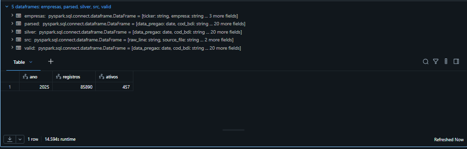

*Figura 2 — Registros e ativos distintos produzidos pela transformação Silver.*

As tabelas foram persistidas no schema `workspace.mvp_b3` e registradas no catálogo do Databricks.

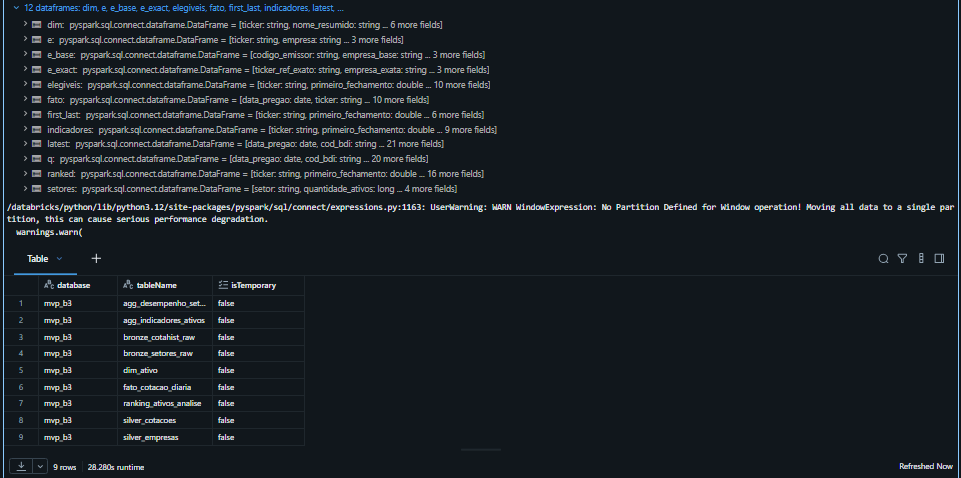

*Figura 3 — Evidência das tabelas Delta persistidas no schema `mvp_b3`, incluindo objetos Bronze, Silver, Gold e qualidade.*

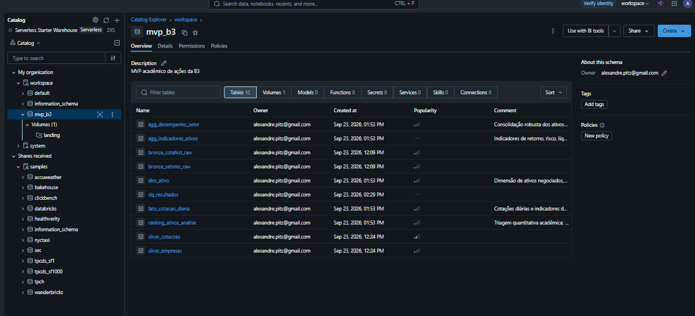

*Figura 4 — Catalog Explorer do Databricks mostrando o schema `workspace.mvp_b3`, suas 10 tabelas, o Volume `landing` e os comentários aplicados às tabelas Gold.*

## Pipeline de Dados (Etapa 4.4)

O processo foi dividido em seis notebooks para separar responsabilidades, facilitar a manutenção e permitir reexecuções controladas:

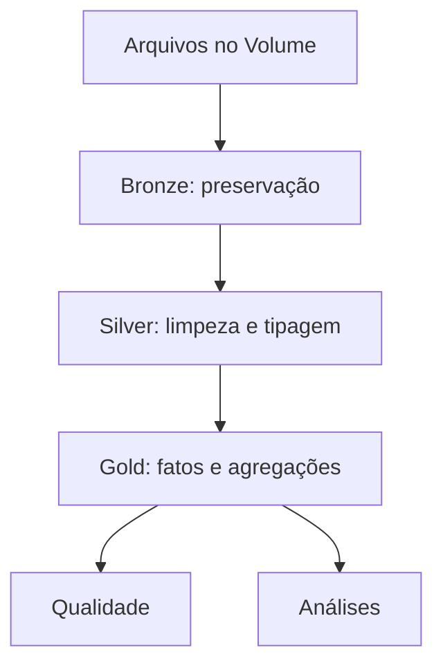

| Ordem | Notebook | Responsabilidade |
|---:|---|---|
| 0 | [`00_setup.ipynb`](notebooks/00_setup.ipynb) | Configurar catálogo, schema, Volume e parâmetros |
| 1 | [`01_bronze_ingest.ipynb`](notebooks/01_bronze_ingest.ipynb) | Ingerir e preservar os dados brutos |
| 2 | [`02_silver_transform.ipynb`](notebooks/02_silver_transform.ipynb) | Interpretar o layout posicional, tipar, filtrar e deduplicar |
| 3 | [`03_gold_model.ipynb`](notebooks/03_gold_model.ipynb) | Criar dimensão, fato, indicadores, setores e ranking |
| 4 | [`04_data_quality.ipynb`](notebooks/04_data_quality.ipynb) | Executar e persistir regras de qualidade |
| 5 | [`05_analysis.ipynb`](notebooks/05_analysis.ipynb) | Responder às perguntas de negócio e gerar o gráfico |

O código foi integrado ao repositório público por meio de uma **Git folder** do Databricks, denominação atual do antigo Databricks Repos.

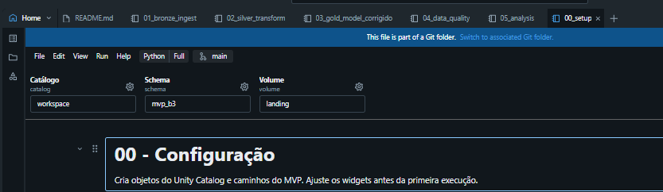

*Figura 5 — Notebook executado dentro da Git folder e associado à branch `main`.*

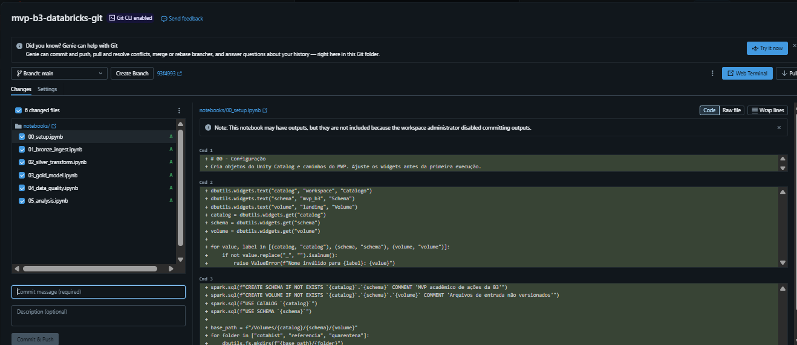

*Figura 6 — Seis notebooks organizados na pasta `notebooks/` e preparados para versionamento no GitHub.*

### Persistência e cobertura setorial

A dimensão Gold contém **457 linhas e 457 tickers distintos**. Após o complemento histórico da referência, não restou nenhum ativo com setor `NAO_INFORMADO`.

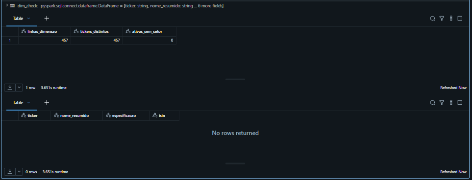

*Figura 7 — Validação da unicidade da dimensão e cobertura setorial completa: zero ativos sem setor.*

## Qualidade de Dados (Etapa 4.5)

O notebook [`04_data_quality.ipynb`](notebooks/04_data_quality.ipynb) verifica completude, consistência, acurácia plausível, unicidade, cobertura setorial e retornos atípicos.

| Problema verificado | Tratamento aplicado | Resultado |
|---|---|---:|
| Chaves ou fechamento nulos | registros inválidos não avançam para Silver | 0 ocorrência |
| Preço não positivo ou máximo menor que mínimo | filtragem na Silver e regra impeditiva | 0 ocorrência |
| Volume, quantidade ou negócios negativos | filtragem e validação | 0 ocorrência |
| Duplicidade de data + ticker | `row_number`, mantendo o registro mais recente | 0 duplicidade |
| Ativo sem setor | correspondência exata do ticker e fallback pelo código-base | 0 ativo |
| Retorno diário atípico | identificação por intervalo interquartil, sem remoção automática | 7.449 ocorrências |

Os **7.449 retornos atípicos**, equivalentes a aproximadamente **8,67%** dos 85.890 registros, receberam status informativo. Eles foram preservados porque podem representar movimentos reais ou efeitos de eventos corporativos, como grupamentos e desdobramentos.

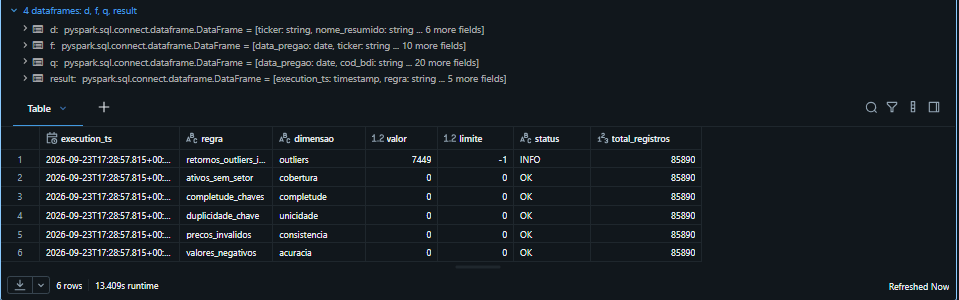

*Figura 8 — Resultado das seis regras de qualidade. Não houve regra impeditiva com status de falha.*

## Análise de Dados (Etapa 4.5)

### Pergunta 1 — Qual o comportamento dos principais setores?

Para reduzir a influência de empresas muito grandes, o desempenho setorial foi calculado pela mediana dos retornos dos ativos elegíveis. A elegibilidade exige ao menos 180 pregões e volume médio diário igual ou superior à mediana do universo.

| Setor | Retorno mediano em 2025 |
|---|---:|
| Utilidade Pública | 50,77% |
| Consumo Cíclico | 46,52% |
| Comunicações | 43,77% |
| Financeiro | 35,17% |
| Saúde | 32,14% |
| Tecnologia da Informação | 31,08% |
| Materiais Básicos | 6,18% |
| Bens Industriais | -1,54% |
| Consumo não Cíclico | -3,00% |
| Petróleo, Gás e Biocombustíveis | -19,62% |

O setor Financeiro apresentou o maior volume agregado entre os ativos elegíveis. Em retorno mediano, destacaram-se Utilidade Pública, Consumo Cíclico e Comunicações. Petróleo, Gás e Biocombustíveis apresentou o resultado mais fraco do período.

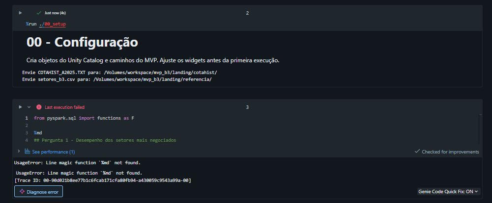

*Figura 9 — Indicadores por setor: quantidade de ativos, volume médio, retorno, volatilidade e proporção acima da média móvel de 200 pregões.*

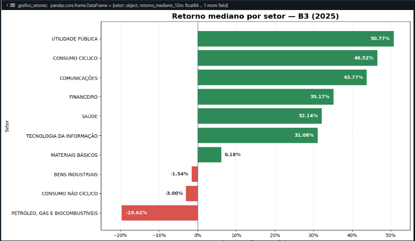

*Figura 10 — Comparação visual do retorno mediano setorial em 2025. Verde representa retorno positivo e vermelho, retorno negativo.*

### Pergunta 2 — Qual o cenário mais favorável para os próximos meses?

O MVP não prevê preços futuros. Ele classifica o cenário técnico observado a partir do retorno mediano do universo elegível e da proporção de ativos acima da média móvel de 200 pregões.

Foram avaliados **209 ativos**. O conjunto apresentou:

- retorno mediano anual de **27,25%**;
- **60,77%** dos ativos acima da média móvel de 200 pregões;
- volatilidade mediana anualizada de **36,57%**;
- classificação condicional: **FAVORÁVEL**.

Portanto, os dados de 2025 indicam um cenário técnico favorável, caracterizado por retorno mediano positivo e participação majoritária acima da tendência de longo prazo. Essa classificação é retrospectiva e condicional: não representa previsão nem garantia de continuidade nos meses seguintes.

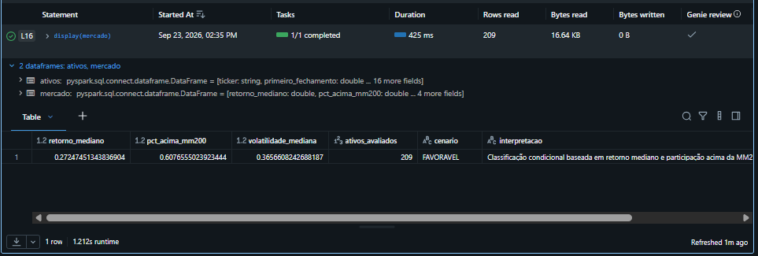

*Figura 11 — Resultado da regra de cenário aplicada aos 209 ativos elegíveis.*

### Pergunta 3 — Quais ações devem ser analisadas para possível compra?

O ranking é uma triagem acadêmica. A pontuação combina retorno anual (30%), tendência relativa à média móvel de 200 pregões (25%), liquidez (25%) e menor volatilidade (20%).

Os 15 ativos mais bem posicionados foram:

| Posição | Ticker | Setor |
|---:|---|---|
| 1 | ELET3 | Utilidade Pública |
| 2 | ENEV3 | Utilidade Pública |
| 3 | CPFE3 | Utilidade Pública |
| 4 | CPLE6 | Utilidade Pública |
| 5 | ELET6 | Utilidade Pública |
| 6 | CSMG3 | Utilidade Pública |
| 7 | VALE3 | Materiais Básicos |
| 8 | ORVR3 | Utilidade Pública |
| 9 | ALOS3 | Financeiro |
| 10 | SRNA3 | Utilidade Pública |
| 11 | NEOE3 | Utilidade Pública |
| 12 | BBDC4 | Financeiro |
| 13 | CPLE3 | Utilidade Pública |
| 14 | SBSP3 | Utilidade Pública |
| 15 | HBSA3 | Consumo Cíclico |

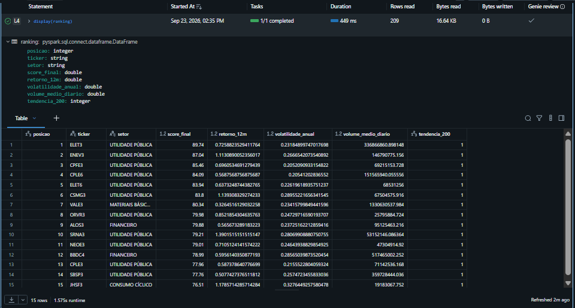

*Figura 12 — Ranking dos 15 ativos com melhor pontuação segundo os critérios definidos no MVP.*

A predominância de Utilidade Pública demonstra coerência com o resultado setorial, mas também evidencia concentração. Por isso, a lista não deve ser interpretada como carteira pronta ou ordem de compra. Antes de qualquer decisão real, devem ser avaliados fundamentos, endividamento, valuation, governança, eventos corporativos, diversificação e adequação ao perfil do investidor, preferencialmente com profissional autorizado.

## Autoavaliação

Considero que o MVP atingiu o objetivo de construir um pipeline de dados ponta a ponta na nuvem. Foi possível carregar dados públicos da B3, preservar a origem, transformar o formato posicional, aplicar regras de qualidade, modelar tabelas Delta, enriquecer os ativos com classificação setorial e produzir análises reprodutíveis.

As principais dificuldades foram compreender o layout fixo do COTAHIST, adaptar os notebooks às limitações do Databricks Free Edition, tratar a diferença entre ticker completo e código-base do emissor e complementar empresas históricas que não constavam com o mesmo código na classificação setorial atual. Outro aprendizado relevante foi integrar os notebooks ao GitHub por meio da Git folder do Databricks.

Como limitações, a análise utiliza somente o histórico de preços e negociação de 2025, não ajusta explicitamente todos os eventos corporativos e não considera demonstrações financeiras, cenário macroeconômico, valuation ou custos de transação.

Como trabalhos futuros, pretendo implementar cargas incrementais, ajustes de preços por proventos e eventos corporativos, integração com dados fundamentalistas, orquestração agendada, alertas de qualidade, dashboard no Databricks SQL ou Power BI e backtest do modelo de pontuação.

## Como executar

1. Clone este repositório como Git folder no Databricks.
2. Execute `00_setup` para criar ou validar os objetos necessários.
3. Envie `COTAHIST_A2025.TXT` e `setores_b3.csv` para os caminhos indicados no Volume.
4. Execute os notebooks de `01` a `05` na ordem numérica.
5. Consulte `dq_resultados` e as tabelas Gold para validar a execução.

Mais detalhes estão em [`docs/guia_execucao.md`](docs/guia_execucao.md).

## Estrutura do repositório

```text
mvp-b3-databricks/
├── notebooks/
│   ├── 00_setup.ipynb
│   ├── 01_bronze_ingest.ipynb
│   ├── 02_silver_transform.ipynb
│   ├── 03_gold_model.ipynb
│   ├── 04_data_quality.ipynb
│   └── 05_analysis.ipynb
├── docs/
│   ├── images/
│   ├── catalogo_dados.md
│   └── guia_execucao.md
├── .gitignore
├── LICENSE
└── README.md
```

## Checklist de entrega

- [x] Repositório GitHub público
- [x] Databricks conectado ao GitHub por Git folder
- [x] Notebooks de configuração, Bronze, Silver, Gold, qualidade e análise
- [x] Dados brutos não disponibilizados no GitHub
- [x] Catálogo de dados transcrito
- [x] Evidências de tabelas persistidas
- [x] Evidência das regras de qualidade
- [x] Evidências das três respostas de negócio
- [x] Resultados numéricos transcritos no README
- [x] Autoavaliação e trabalhos futuros

## Referências

- [B3 — Hub de Dados Públicos](https://www.b3.com.br/pt_br/dados/hub-de-dados-publicos/)
- [Databricks — Arquitetura Medalhão](https://docs.databricks.com/aws/en/lakehouse/medallion)
- [Databricks — Git folders](https://docs.databricks.com/aws/en/repos/)
- [Databricks — Unity Catalog](https://docs.databricks.com/aws/en/data-governance/unity-catalog/)
- [Delta Lake](https://docs.delta.io/)
